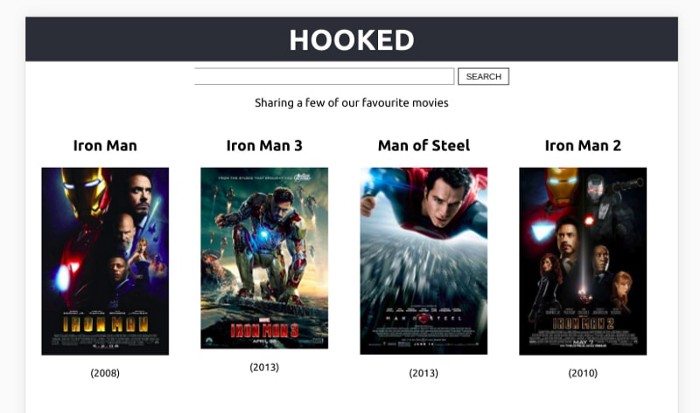

This project was bootstrapped with [Create React App](https://github.com/facebook/create-react-app).

## Available Scripts

In the project directory, you can run:

### `npm start`

Runs the app in the development mode. 
Open [http://localhost:3000](http://localhost:3000) to view it in the browser.

The page will reload if you make edits. 
You will also see any lint errors in the console.

## Tech stack and features
  *  React with hooks
  *  create-react-app
  *  JSX
  *  CSS
### what does this app do: 
- it's a fron end page for a movie search engine, it's attached to the OMDb API with a unique API key only registered to me, if you would fork this repo please replace the API key found in (app.js) file with your.
- you can get your own API key 
  
  

